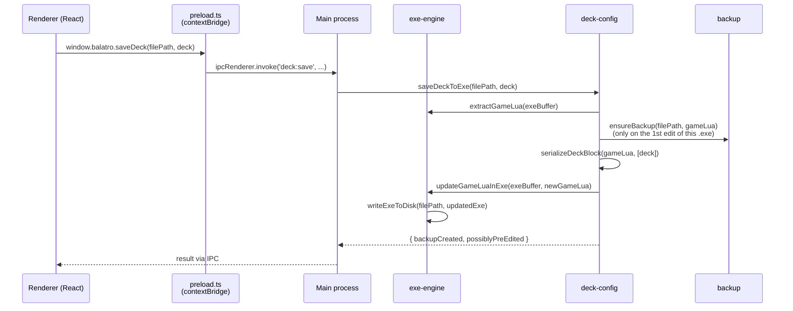

# Balatro EXE Editor

Desktop app (Electron + React + Vite + TypeScript) that edits `balatro.exe` directly, through a
friendly UI, replacing the manual workflow of opening the `.exe` in 7-Zip, extracting `game.lua`,
editing it in Notepad, and reinjecting it.

## Table of contents

- [What the project does](#what-the-project-does)
- [What was delivered](#what-was-delivered)
- [How to run](#how-to-run)
- [Architecture](#architecture)
- [Tests](#tests)
- [Internationalization](#internationalization)
- [Backlog](#backlog)
- [Changelog](#changelog)
- [Links](#links)

## What the project does

Balatro on Windows ships as a "fused" LÖVE2D executable: `[binary stub][concatenated ZIP]`. The
game reads that ZIP backward from the end of the file — the stub is never parsed, it just needs
to be preserved byte-for-byte on write. Inside the ZIP lives `game.lua`, and inside that, the 15
playable decks + `b_challenge` sit in a single block, each with a `config` table whose keys
(`dollars`, `hands`, `discards`, `joker_slot`, `consumable_slot`, `consumables`) are **deltas
added to a game base value** — not absolute values. A deck without the `dollars` key, for
example, uses the game's default base value.

The app abstracts all of that away: point it at your `balatro.exe`, pick a deck, edit the fields
through a normal form, and it locates the embedded ZIP, extracts `game.lua`, applies the changes
to the text, reinjects the edited ZIP, and rewrites the `.exe` — keeping the stub untouched.

Edit per deck (all 15 playable decks + the Challenge deck, individually):
- Starting money
- Joker slots
- Consumable slots
- Starting consumables (Tarots, Planets, Spectrals)

With an automatic backup of the original `game.lua` before the first edit, a non-blocking
warning if a value goes past the tested-safe range, and a restore-to-default option at any time.

## What was delivered

Full backlog (MVP + post-MVP) in [`backlog/BACKLOG.md`](backlog/BACKLOG.md) — source of truth,
updated with every story.

- **[BEE-1](backlog/_epicas/BEE-1.md) · Setup & Foundation**: Electron + React + Vite + TS, a
  typed IPC bridge, persisted settings (`electron-store`), TDD test suite from day one.
  Post-MVP: GitHub Actions release pipeline (packages a portable `.exe` — no installer — when a
  tag is published), a native splash window shown while the app boots, a footer with credits and
  app version (read from `app.getVersion()`, no number duplicated in code).
- **[BEE-2](backlog/_epicas/BEE-2.md) · Design**: a synthesis prompt for Claude Design to
  generate a prototype with Balatro's visual identity; the theme foundation applied to the app
  from it — every new screen is born styled, no separate restyling pass. Post-MVP: an original
  logo and banner (not the game's own artwork), generated from a second design prompt and
  applied as the app icon and the home screen banner.
- **[BEE-3](backlog/_epicas/BEE-3.md) · `.exe` read/write engine**: locating the embedded ZIP,
  extracting and reinjecting `game.lua`, `.exe` file selection with validation. Generalized
  post-MVP to read any entry from the embedded ZIP by path, not just `game.lua`.
- **[BEE-4](backlog/_epicas/BEE-4.md) · Deck config parsing**: parser and serializer for the
  deck block in `game.lua`, consumable catalog extracted from the `.exe` itself (not hardcoded).
- **[BEE-5](backlog/_epicas/BEE-5.md) · Deck editor (UI)**: deck selection, numeric fields form,
  starting consumables editor, save changes — closes the full MVP loop. Post-MVP: each
  consumable shows its real in-game artwork (cropped from the game's own sprite atlas, extracted
  from the user's `.exe` — no game assets bundled with the app) in the picker and as chips, plus
  a hover tooltip with a larger image, name, and an effect description (pulled from the game's
  own localization files, in whichever of the 3 supported languages is active).
- **[BEE-6](backlog/_epicas/BEE-6.md) · Backup & Restore**: automatic backup on the first edit
  (with detection of files possibly already edited outside the app, compared against the game's
  real default values), restore to default.
- **[BEE-7](backlog/_epicas/BEE-7.md) · Internationalization**: English (default/fallback),
  Portuguese (BR) and Spanish, with a language selector in the UI.
- **[BEE-8](backlog/_epicas/BEE-8.md) · Automatic install detection (post-MVP)**: an explicit
  "detect automatically" action on the first screen locates a Steam install of Balatro (Windows
  registry → Steam library folders → app manifest), as an alternative to browsing manually.
- **[BEE-9](backlog/_epicas/BEE-9.md) · macOS/Linux support** and
  **[BEE-10](backlog/_epicas/BEE-10.md) · generic `game.lua` field editor**: scoped, then
  cancelled — no real demand materialized for either.
- **[BEE-11](backlog/_epicas/BEE-11.md) · Challenges (not implemented)**: investigated whether
  decks can start with specific Jokers — confirmed that's a Challenge-only mechanic in the game,
  not a per-deck one. Rescoped into a Challenge-jokers editor; technically mapped out but
  deliberately left for last.

## How to run

Prerequisites: **Node.js** + **npm**.

```bash
npm install
npm run dev          # runs the app in dev mode (Vite + Electron)
npm test             # runs the test suite (Vitest)
npm run package      # builds a portable Windows .exe (electron-builder), into release/
```

The version shown in the footer and window title comes from `app.getVersion()`, which reads the
`version` field from `package.json` — updated manually before each release tag.

## Architecture



### Processes: main (Electron/Node) and renderer (React)

- **`electron/`** (main process, Node): filesystem access, native dialogs, all domain logic —
  organized by feature (`exe-engine/`, `deck-config/`, `backup/`, `consumable-catalog/`,
  `steam-detection/`, `settings/`, `ipc/`), not by technical layer.
- **`src/`** (renderer, React): UI only — screens in `src/screens/`, types/schemas shared with
  main in `src/shared/`.
- **`src/shared/ipc-contract.ts`**: the single source of truth for IPC channel names and
  payload/return types (`IPC_CHANNELS` + the `BalatroApi` interface). `electron/preload.ts`
  implements that interface via `contextBridge.exposeInMainWorld`, and the renderer only ever
  sees a fully-typed `window.balatro.*` — main and preload can't silently drift apart on a
  channel's shape, since both import from the same file.

### Locating the ZIP inside the `.exe`

`electron/exe-engine/locate-embedded-zip.ts` scans the `.exe` backward looking for the End Of
Central Directory signature (`PK\x05\x06`) — the same trick SFX/self-extracting archive tools
use. From the EOCD, it reads the central directory's relative offset to compute where the ZIP
actually starts (subtracting the LÖVE2D binary stub's size), then validates by opening the
result with `adm-zip` before trusting the offset — the EOCD arithmetic can close by coincidence
on a corrupted file, so actually opening the ZIP is the final confirmation.

### A purpose-built Lua parser (not a real Lua parser)

`electron/deck-config/parse-deck-block.ts` uses regex + manual brace-balance counting to extract
the deck block from `game.lua`, instead of a full Lua parser — a deliberate call: the target is
a narrow, regular format (one line per deck, known numeric keys), so a general-purpose parser
would be complexity without real benefit.

### Backup and pre-existing edit detection

`backup/backup-service.ts` guarantees **one backup per `.exe`**: the first write to a given path
saves the untouched `game.lua`; subsequent writes reuse that same backup, never overwriting it
with an already-edited version. At that same moment, `backup/detect-preexisting-edits.ts`
compares the freshly-read `game.lua` against `KNOWN_DEFAULT_DECKS` (the game's real default
values, extracted from the original `game.lua`) — if it already differs before this app's first
backup, the result includes `possiblyPreEdited: true`, and the UI (`SaveButton`) shows a
non-blocking warning: the backup may not reflect the game's 100% original `game.lua`.

### Testability via dependency injection

All main-process logic receives `readFile`/`writeFile`/`backupService`/`knownDefaults` as
parameters instead of importing `fs`/`electron` directly — tests run without a real Electron
instance and without touching disk, using simple fakes.

## Tests

- **Vitest**, `environment: 'node'` as the project default — a global `environment: 'jsdom'`
  silently breaks `adm-zip` (Vite starts resolving browser module conditions, and the lib
  resolves to an incompatible shim). React component tests opt into `jsdom` individually via
  `// @vitest-environment jsdom` at the top of the file.
- Synthetic fixtures versioned in `test/fixtures/` — no test depends on the game's real
  `game.lua`/`.exe` (proprietary content, excluded from git).
- 47 test files, 161 tests, covering the main process (unit, with fakes) and React components
  (`@testing-library/react`).

## Internationalization

`i18next` + `react-i18next`, English as the default/fallback language
(`src/i18n/locales/{en,pt-BR,es}.ts`), with a language selector in the UI. Project convention:
no hardcoded UI strings in JSX — always `t('namespace.key')`.

## Backlog

Backlog-as-code in [`backlog/`](backlog/) — see [`backlog/README.md`](backlog/README.md) for the
full convention (folder-as-state model), and [`.claude/CLAUDE.md`](.claude/CLAUDE.md) for domain
context and the development workflow. Backlog content is in Portuguese (the language it was
authored in).

## Changelog

See [`CHANGELOG.md`](CHANGELOG.md) for what changed release to release.

## Links

- [Nexus Mod](https://www.nexusmods.com/balatro/mods/913);
- [Steam discussions](https://steamcommunity.com/app/2379780/discussions/2/583930834798697183/);
- [VirusTotal](https://www.virustotal.com/gui/file/f630926d3733288f347301435aec5cf6c94ecd9412dd3848fe8cc83fd49fca02/detection).
